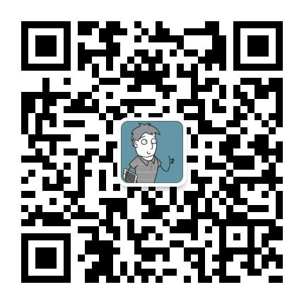
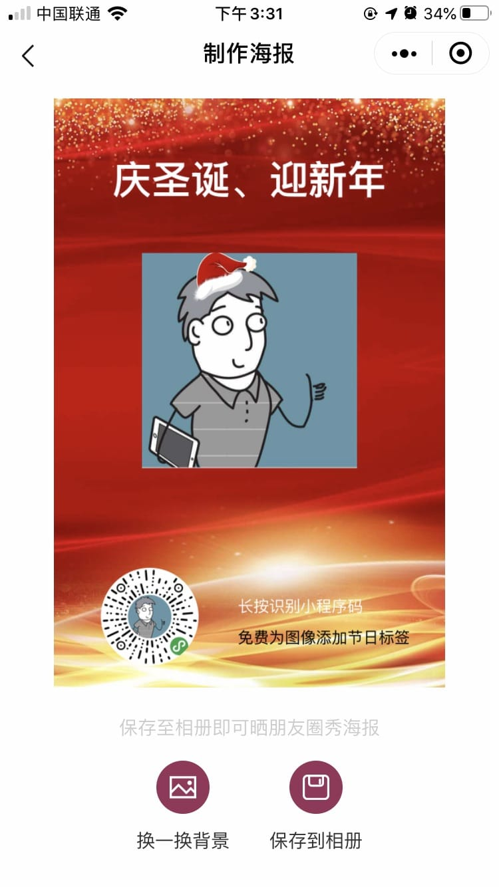

<!--
 * @Author: whc
 * @Date: 2019-11-07 16:39:05
 * @LastEditTime : 2020-01-05 16:12:38
 -->
# whc_wechat_image_edit

[](https://raw.githubusercontent.com/attentiveness/whcapp/master/LICENSE)

开源一个完整微信小程序app，已经上线了名称《节日头像生成》
主要功能：给微信头像进行编辑添加节日标签, 节日海报的制作生成
觉得有帮助小星星支持一下

在线微信小程序体验：


微信公众号体验：



## App Architecture
```
environment:
  libVersion: "2.9.4"
```


## Screenshot



## Contributing

Any good Suggestions or questions to ask or email

## License

Apache License 2.0

